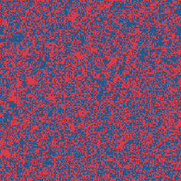
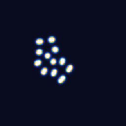
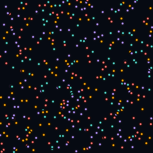
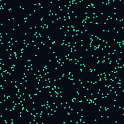

# ◈ Genesis — Artificial Life Laboratory

<div align="center">

**Six substrates. One garden. Infinite structures.**

<br />


<br />
<sub><i>Gray-Scott reaction-diffusion (coral pattern, F=0.0545, k=0.062). One of six live substrates.</i></sub>

<br /><br />

A browser-based, real-time artificial life laboratory spanning statistical mechanics, continuous cellular automata, 4D hyperrotation projection, multi-channel predator-prey ecology, reaction-diffusion morphogenesis, particle ecology, and self-organizing particle systems.

[](LICENSE)
[](https://reactjs.org/)
[](https://vitejs.dev/)

[**→ Launch Live Demo**](https://kquant03.github.io/genesis-phase-transition/)

</div>

---

## What is this?

Genesis is a multi-dimensional artificial life laboratory implementing six distinct simulation substrates in a single browser application. Each reveals a different mechanism by which complex, lifelike behavior emerges from simple mathematical rules. Every simulation runs entirely client-side — no backend. WebGL2 for GPU-accelerated substrates, pure canvas elsewhere.

## Quick Start

```bash
git clone https://github.com/Kquant03/genesis-phase-transitions.git
cd genesis-phase-transitions
npm install
npm run dev
```

Opens at `http://localhost:3000`.

---

## The Six Substrates

### ◈ Ising Model — Phase Transitions



The 2D Ising model on a square lattice — the cornerstone of statistical mechanics. The exact critical temperature T_c = 2/ln(1+√2) ≈ 2.269 separates ordered ferromagnetic domains from paramagnetic disorder via a continuous second-order phase transition.

**Features:**
- Dual Monte Carlo: Metropolis-Hastings (single-spin) + Wolff cluster (FK percolation)
- Hoshen-Kopelman cluster decomposition with golden-ratio coloring
- Four visualization modes: spin, cluster, domain walls, energy density
- Six live observables: M, |M|, E, χ, C_v, U_L (Binder cumulant)
- Social interpretation layer after Tsarev et al. (2019)
- Auto temperature sweep with susceptibility divergence at T_c

**Critical exponents (exact):** β = 1/8 · γ = 7/4 · ν = 1 · α = 0 (log) · η = 1/4 · δ = 15

<br clear="right" />

---

### ◉ Lenia — Continuous Cellular Automata


After Bert Chan (2018). A continuous cellular automaton where space, time, and state are all smooth. WebGL2 GPU-accelerated with shader-based bloom, running at 60fps on a 256×256 toroidal grid. Eight species including *Orbium unicaudatus ignis* var. *phantasma* — the **Ghost**, a novel species engineered to inhabit the edge of chaos.

**The math:**
```
K(r) = exp(4 − 4 / (4r(1−r)))            Exponential bump kernel
U(x) = Σ K(‖x − y‖/R) · A(y)             Convolution potential field
G(u) = 2·exp(−(u − μ)² / 2σ²) − 1        Growth function
A^(t+dt) = clip(A^t + dt·G(U), 0, 1)      State update
```

**Eight species:** Orbium (glider soliton) · Bicaudatus (two-tailed) · Ignis (fire form) · Ignis ×2 (fire two-tailed) · Laxus (loose oscillator) · Vagus (large-field wanderer) · Soup (ecosystem) · **Ghost** (sustained edge-of-chaos morphing)

**The Ghost species** seeds the Ignis morphology (tuned for σ=0.012) under deliberately mismatched parameters (σ=0.015, R=15). The organism remembers its shape but cannot reach it — producing perpetual morphing, field-mediated inter-organism communication, and emergent network ripples across populations of 16 individuals. [**→ Read the full Ghost species paper**](docs/ghost_species.pdf)

<br clear="right" />

---

### ✦ Lenia · Expanded Universe — Multi-Channel Ecosystem with 4D *Dihypersphaerome ventilans*

After Bert Chan (2020). The canonical second paper in the Lenia series extended the framework to higher dimensions, multiple kernels, and multiple coupled channels — discovering new phenomena including polyhedral symmetries, individuality, self-replication, and "virtual eukaryotes" with internal division of labor. Genesis implements a four-channel ecosystem grounded in this architecture, with a fourth channel dedicated to projecting the 4D species ***Dihypersphaerome ventilans*** (code: **3Hy2v**, Chinese: 乙超球, "second hypersphere") into the 2D world.

**The four channels:**
- **Ch0 — Prey** (amber/gold): Orbium-class gliders, single-peak kernel (μ=0.15, σ=0.017)
- **Ch1 — Predator** (electric cyan): Multi-peak kernel β=[1/3, 2/3, 1] (μ=0.26, σ=0.036). Starves without prey, consumes prey mass, suppresses prey growth in its vicinity
- **Ch2 — Morphogen** (deep teal): Wide diffuse field (R=20) secreted by both prey and predator. Spatially modulates σ for both channels — the morphogen landscape changes the physics of survival across the board
- **Ch3 — 4D Shadow**: The rotating 2D cross-section of *Dihypersphaerome ventilans*, bleeding into the prey channel and seeding the ecosystem from hyperspace

**The simulation pipeline (per frame):**
```
1. HYPER_FRAG:  rotate 4D DV body (XW/YW/ZW planes) → 2D cross-section
2. FLOW_FRAG:   compute velocity field from prey/morphogen gradients
3. SIM_FRAG:    advect state by flow → convolve 3 kernels → cross-channel coupling
4. DISPLAY:     ecosystem rendering (6 view modes including flow field and 4D projection)
5. BLOOM → COMPOSITE
```

**Cross-channel coupling:**
```
G₀ −= c₀₁·A₁                     predator suppresses prey growth
G₁ += c₁₀·A₀ − 0.012             prey feeds predator; starvation constant
σ₀_eff = σ₀·(1 + c₂₀·(A₂ − 0.3)) morphogen widens prey niche
G₀ += A₃·hyperMix·0.4             4D shadow seeds prey nucleation
à   = advect(A, ∇A·Φ)             flow advection on all channels
```

**About *Dihypersphaerome ventilans*:** DV is one of the rarest organisms in the Lenia taxonomy — a named 4D species whose behavior class is SO (Stationary Oscillation), subcategory *ventilans* (Latin: to fan, to breathe, to ventilate). It does not translate or rotate. It breathes. Its defining feature is a three-shell kernel with β = [1/12, 1/6, 1]: the outer ring weight is **12× stronger than the inner ring**, making the organism's boundary more important to its physics than its interior. It knows where it ends far better than it knows what it contains. [**→ Read the full DV species paper**](docs/Dihypersphaerome_ventilans-1.pdf)

The 4D hyperrotation controls in the right panel let you adjust the three rotation axes (XW, YW, ZW) independently, varying the appearance of its 2D cross-section from a faint ring at equatorial observation to near-nothing at the poles. The ZW rotation IS the breathing — adjusting its speed changes the ventilation rate.

**Five ecosystem presets:**
- **Duel** — 3 prey vs 1 predator. Classic initial conditions. Will they survive?
- **Swarm** — 8 prey vs 3 predators. Arms race conditions
- **Coexist** — Separated factions. Watch what happens at first contact
- **Invasion** — Established prey colony, predator invades from one side
- **DV Seed** — Empty ecosystem, only the 4D channel initialized. Prey nucleate from the Night Fury's shadow; predators follow. The ecosystem emerges from hyperspace

**Six view modes:** Ecosystem · Prey only · Predator only · 4D Projection · Flow Field · Morphogen

<br clear="right" />

---

### ◎ Gray-Scott Reaction-Diffusion — Morphogenesis



The Gray-Scott model (Pearson, 1993) — two coupled PDEs that produce an extraordinary zoo of pattern types from spots that divide like cells to labyrinthine coral.

**The equations:**
```
∂u/∂t = D_u∇²u − uv² + F(1 − u)
∂v/∂t = D_v∇²v + uv² − (F + k)v
```

**Eight Pearson classification presets:** Mitosis (self-replicating spots) · Coral (labyrinthine) · Spirals · Worms · Solitons · U-Skate (gliders) · Waves · Bubbles

**Features:** Click-to-seed interaction, three color modes (chemical, heat, mono), real-time F/k parameter control spanning the full pattern space.

<br clear="right" />

---

### ◆ Particle Life — Emergent Ecology



Asymmetric N×N force matrices between particle types. When A→B ≠ B→A, Newton's third law breaks and net energy enters the system — the minimal mechanism for predation, symbiosis, orbital capture, and membrane formation.

**Force function:**
```
Repulsion zone (r < β):    F(r) = r/β − 1
Interaction zone (r ≥ β):  F(r) = a · (1 − |1+β−2r| / (1−β))
```

Where `a = M[type_i][type_j]` from the asymmetric interaction matrix.

**Four matrix presets:** Random · Predator-Prey (cyclic chase) · Symbiosis (mutual attraction) · Chaos

**Features:** Live interaction matrix display, adjustable range/friction/repulsion, trail rendering.

<br clear="right" />

---

### ◇ Primordial Particles — Life from Turning



After Schmickl et al. (2016, *Scientific Reports*). The simplest known model producing a complete cell lifecycle. Each particle follows **one equation with two parameters:**

```
Δφᵢ = α + β · Nᵢ · sign(Rᵢ − Lᵢ)
```

From this alone: cells form, grow, divide, produce spores, migrate, self-repair, and exhibit logistic population dynamics. The "Region of Life" exists at α ≈ 180°, β ≈ 17°.

**Five presets:** Cell Life · Worms · Swirls · Crystals · Gas

**Features:** Density-based coloring (neighbor count), heading-based coloring, real-time α/β control.

<br clear="right" />

---

## Connection to Broader Research

This repository is part of the **Teármann Research Ecosystem:**

- **Shoal-Broadcast Architecture** — The Ghost species IS the shoal-broadcast pattern made visible: organisms communicating not through discrete messages but through perturbations in a shared continuous scalar field. Each Ghost's morphological instability becomes a signal source for its neighbors. The Expanded Universe substrate takes this further: the morphogen field (ch2) is a broadcast medium sculpted in real time by every organism in the simulation.
- **Tsarev–Dicke Mapping** — The Ising substrate connects to Tsarev et al.'s quantum-optics model of social opinion dynamics, where the superradiant phase transition = spontaneous consensus formation
- **CLAIRE/Teármann Thesis** — Mechanistically transparent simulation data formally collapses underspecification in ML training. Every causal pathway in Genesis is observable. The 4D projection in the Expanded Universe substrate makes this literal: the causal influence of a 4D organism on a 2D ecosystem is fully traced, frame by frame, through the hyperMix parameter.
- ***Dihypersphaerome ventilans* and the Layer 4 thesis** — DV lives in a dimension that 2D Lenia cannot represent. Its influence on the 2D ecosystem is real but indirect — mediated through projection and cross-channel bleeding. This is an analogy for Layer 4 reasoning: thinking *across* causal graph structures rather than within them. The Night Fury seeds the world it moves through without being visible in it.

---

## Project Structure

```
genesis-phase-transitions/
├── index.html
├── vite.config.js
├── src/
│   ├── main.jsx
│   ├── App.jsx                             # Navigation + live hero simulation
│   └── simulations/
│       ├── SocialPhaseTransitionLab.jsx    # ◈ Ising model (~970 lines)
│       ├── Lenia.jsx                       # ◉ Lenia (GPU WebGL2, ghosts, orbium)
│       ├── LeniaExpanded.jsx               # ✦ Lenia Expanded Universe (4D DV, ecosystem)
│       ├── GrayScottRD.jsx                 # ◎ Gray-Scott RD
│       ├── ParticleLife.jsx                # ◆ Particle Life
│       └── PrimordialParticles.jsx         # ◇ Primordial Particles
├── docs/
│   ├── GENESIS_MANIFESTO.docx
│   ├── ghost_species.pdf                   # O. u. ignis var. phantasma paper
│   ├── dv_species.md                       # Dihypersphaerome ventilans paper ← new
│   ├── tsarev_2019.pdf
│   └── gifs/
└── .github/workflows/deploy.yml
```

---

## References

- **Ising Model:** Onsager (1944); Wolff (1989); Tsarev, D., et al., "Phase transitions in emergent communication," *arXiv preprint* (2024); Tsarev, Trofimova, Alodjants & Khrennikov, "Phase transitions, collective emotions and decision-making problem in heterogeneous social systems," *Sci. Rep.* **9**, 18039 (2019)
- **Lenia:** Chan, B. W.-C., "Lenia: Biology of Artificial Life," *Complex Systems*, 28(3), 251–286 (2019); Chan, B. W.-C., "Lenia and Expanded Universe," *Proceedings of the 2020 Conference on Artificial Life*, ALIFE 2020, 221–229; Faldor, M., et al., "Toward Artificial Open-Ended Evolution within Lenia using Quality-Diversity," *arXiv:2406.04235* (2024); Hamon, G., et al., "Discovering self-organized patterns in Lenia with curiosity-driven exploration," *arXiv* (2024)
- **Species:** Chan, B. W.-C., `animals4D.json`, GitHub: github.com/Chakazul/Lenia (source for *D. ventilans*, code 3Hy2v); Chan, B. W.-C., `animals.json`, GitHub: github.com/Chakazul/Lenia (2D species database); Koons, S. & Claude, "*Dihypersphaerome ventilans* (3Hy2v · 乙超球): A 4D Lenia Species — Characterization, Hyperrotation Simulation, and Ecosystem Integration," Replete AI internal (2026); Koons, S. & Claude, "*O. u. ignis* var. *phantasma*: A Lenia Species Engineered to Inhabit the Edge of Chaos," Replete AI internal (2026)
- **Flow-Lenia:** Plantec, E., et al., "Flow-Lenia: Towards open-ended evolution in cellular automata through mass conservation and parameter localization," *arXiv:2212.07906* (2022, ALIFE 2023 Best Paper); Michel, G., et al., "Exploring Flow-Lenia Universes with a Curiosity-driven AI Scientist," *arXiv:2505.15998* (2025)
- **Gray-Scott:** Pearson, "Complex patterns in a simple system," *Science* **261** (1993); Munafo, mrob.com/pub/comp/xmorphia
- **Particle Life:** Ahmad/Mohr (2022); Ventrella, "Clusters and Chains" (2005)
- **Primordial Particles:** Schmickl et al., "How a life-like system emerges from a simplistic particle motion law," *Sci. Rep.* **6** (2016)
- **Continuous Automata:** Rafler, S., "Generalization of Conway's 'Game of Life' to a continuous domain: SmoothLife," *arXiv:1111.1567* (2011); Conway, J. H., "The Game of Life," *Scientific American*, 223(4), 4–10 (1970)
- **Self-Reproducing Systems:** von Neumann, J., *Theory of Self-Reproducing Automata* (University of Illinois Press, 1966); Wolfram, S., "Universality and complexity in cellular automata," *Physica D*, 10(1–2), 1–35 (1984)
- **Neural CA:** Mordvintsev et al., "Growing Neural Cellular Automata," *Distill* (2020)
- **ASAL:** Sakana AI, "Automating the Search for Artificial Life with Foundation Models" (2025)
- **ALIEN:** Heinemann, alien-project.org (2024 ALIFE Virtual Creatures Competition winner)
- **Color & Rendering:** Quílez, I., "Palettes," *iquilezles.org/articles/palettes/* (2013)
- **Landing Page Music:** Urie, B., "Intermission," *A Fever You Can't Sweat Out*, Fueled by Ramen (2005). Used with love and zero permission — Brendon, you absolute genius.

---

## Build & Deploy

```bash
npm run dev       # Development server with hot reload
npm run build     # Production build → dist/
npm run preview   # Preview production build locally
```

GitHub Pages deploys automatically via the included Actions workflow on every push to `main`.

## License

[MIT](LICENSE)

---

<div align="center">

*乙超球 breathes in dimensions we cannot see. What we observe is the shadow it casts when rotating into ours.*

<br />

Built by [Stanley (Kquant03)](https://github.com/Kquant03) · [Replete AI](https://repleteai.com)

Part of the Teármann Research Ecosystem

</div>
